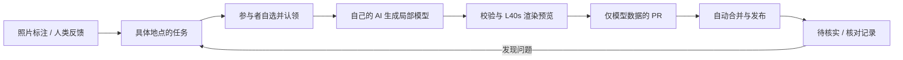

# 共建北大 · PKU Open 3D

**用大家的照片、自己的 AI 和熟悉校园的眼睛，一起把北大建得更真实。**

一扇门、一段四楼走廊，也可以是一份完整贡献。你不用建完整栋楼，也不必同时提供照片、AI 额度和反馈。


本项目直接 Fork 自 [sldyns/PKU-3D](https://github.com/sldyns/PKU-3D)，保留原作历史、校园底模、查看器及署名，在其上加入中文社区协作流程。这是民间共建项目，不是北京大学官方地图或测绘成果。

## 选择你想贡献的部分

| 我能做什么 | 怎么参与 | 身份要求 |
| --- | --- | --- |
| **我有照片** | 选建筑或新增地点 → 标清部位、时间、拍摄位置和方向 → 上传 | 不需要登录 |
| **我愿意用 AI 帮忙** | 自选任务 → 认领资料 → 复制指令给自己的 Codex / Claude Code | GitHub 登录；自己的 AI 额度 |
| **我发现问题** | 定位、圈画 → 说明哪里不对、实际情况和依据 | 不需要登录，也不强制提供照片 |

这三种方式可以任意组合。甲拍照，乙用 AI 建模，丙发现问题后反馈，修改接在同一地点的版本记录里。

**计划站点：[pku-open3d.org](https://pku-open3d.org)。目前为首次部署阶段，固定域名和 GitHub 应用仍需维护者完成授权。** 可按下方说明自建；实例就绪情况由 `/api/v1/health` 提供。

## 我在王选所，可以怎样开始？

1. 打开“我有照片”。列表中没有王选所，就添加新地点并在二维图上定位。
2. 填写“东门”或“四楼东侧走廊”，标注大概拍摄时间、站在哪里、朝哪里拍。不确定就明确标注不确定。
3. 上传前可裁剪、遮挡；提交后保存凭证链接，随时补充或撤回。
4. 到这里已完成贡献；也可点“继续用我的 AI 完善”，认领后复制指令。

**提供外观，就完善外观；提供四楼内部，就增加对应空间。没有依据的部分保持未知。** 第一版没有预造王选所的位置与模型，真实贡献以参与者确认的资料为准。

## 照片与 AI 额度如何使用？

原照只对 GitHub 登录且认领对应任务的人开放，不进入公开 Git、PR、预览或发布包。上传者确认允许建模者参考资料并借助其选择的 AI 服务，生成三维成果公开。拍摄者与拍摄目标的位置分别记录，EXIF 仅作建议。

参与者使用自己的 Codex / Claude Code；平台不接收 AI 密钥、不购买公共额度、不自动连续领取任务。照片、反馈可以独立贡献；矛盾观察保留来源，不以最后上传直接覆盖现实描述。

详见 [贡献指南](CONTRIBUTING.md) 和 [参与及隐私约定](COMMUNITY_LICENSE.md)。

## 把任务交给 AI

网站认领后有“复制给 AI”按钮。也可将以下任务编号换成自己选择的一项：

```text
请阅读 https://github.com/jiangjin1999/pku-open-3d 的 AGENTS.md
和 docs/AI_CONTRIBUTING.md，完成我选择的任务 <task_id>。
使用我的 AI 会话和项目 CLI 下载资料、生成局部模型、请求预览，
根据资料修正后提交，并查询发布结果。只处理这一项任务，
不公开原照，不补造没有依据的部分。
```

首次需要登录和本机配对，之后工具处理上传、分支与 PR。贡献客户端只需要 Node.js 22 或更新版本，不需要先下载完整校园。

## 确认与发布



检查涵盖资料引用、字段、坐标、几何、资源上限、浏览器渲染、部位版本和 PR 文件范围。通过只代表可以发布，不证明现实准确。程序、工作流及部署修改由维护者审阅。失败时上一版本继续可用；维护者可暂停发布、按部位回退。

## 开发与自建

需要 Python 3.12、Node.js 24 和 uv；生产部署不依赖 Docker。

```sh
git clone https://github.com/jiangjin1999/pku-open-3d.git
cd pku-open-3d
uv sync --frozen
npm ci
npm run build:community
# 完整校园资源约 181 MB；只开发贡献页可以跳过下面两步
python3 scripts/assets.py setup
npm run build
npx playwright install chromium
uv run uvicorn community.app:app --host 127.0.0.1 --port 18430 --no-access-log
# 另开终端：uv run python -m community.worker
```

打开 `http://127.0.0.1:18430/`。未配置 GitHub 应用时，可匿名提交、二维定位和浏览校园；认领与自动 PR 等待授权。开发数据默认在被忽略的 `.local/data/`。服务器使用独立运行环境、用户服务和固定 HTTPS 隧道。

| 文档 | 内容 |
| --- | --- |
| [AI 操作指南](docs/AI_CONTRIBUTING.md) | 从领取到发布 |
| [模型规范](docs/MODEL_FORMAT.md) | 层级、网格、坐标、资料和版本 |
| [系统结构](docs/ARCHITECTURE.md) | 权限、数据、可信发布程序 |
| [部署与恢复](docs/OPERATIONS.md) | L40s、Cloudflare、GitHub App、备份和回退 |
| [验收记录](docs/ACCEPTANCE.md) | 验证范围与外部前置条件 |

## 原作与许可

感谢 [sldyns/PKU-3D](https://github.com/sldyns/PKU-3D)。上游提交、Release 与资源校验值固定在 [UPSTREAM.json](UPSTREAM.json)。资产从固定上游 Release 获取，社区贡献只提交到本 Fork。

代码和原创程序化资产遵循 [MIT](LICENSE)。© OpenStreetMap contributors 的地理数据库及其改编仍遵循 [ODbL](DATA_LICENSE.md)。MIT 不覆盖第三方照片、商标及建筑作品权利；社区贡献另见 [COMMUNITY_LICENSE.md](COMMUNITY_LICENSE.md)。
