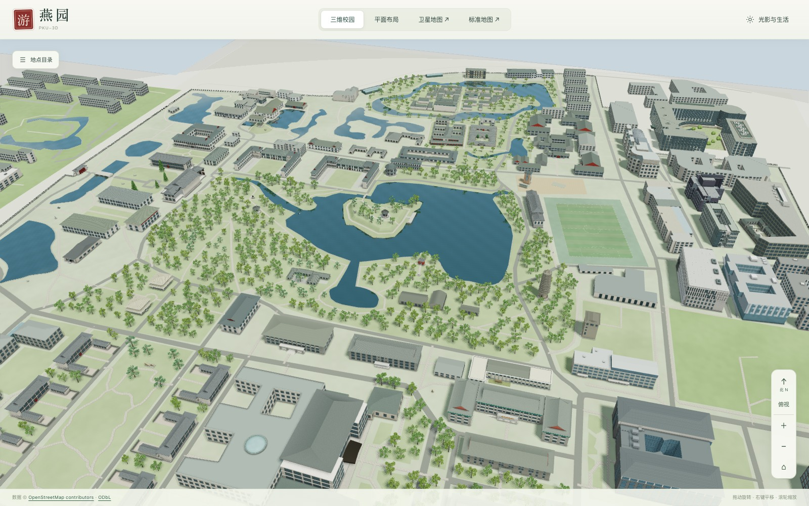
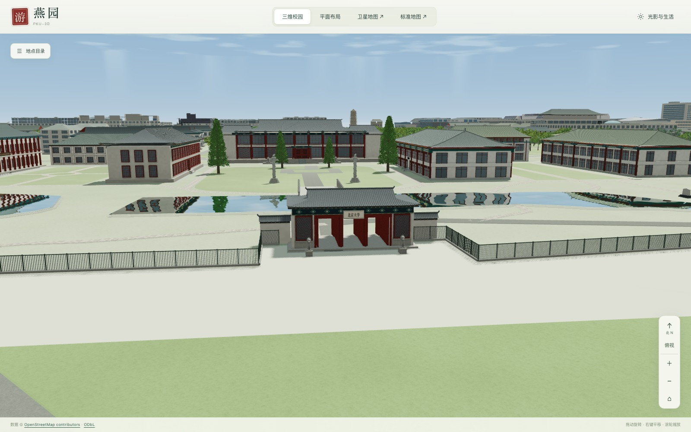
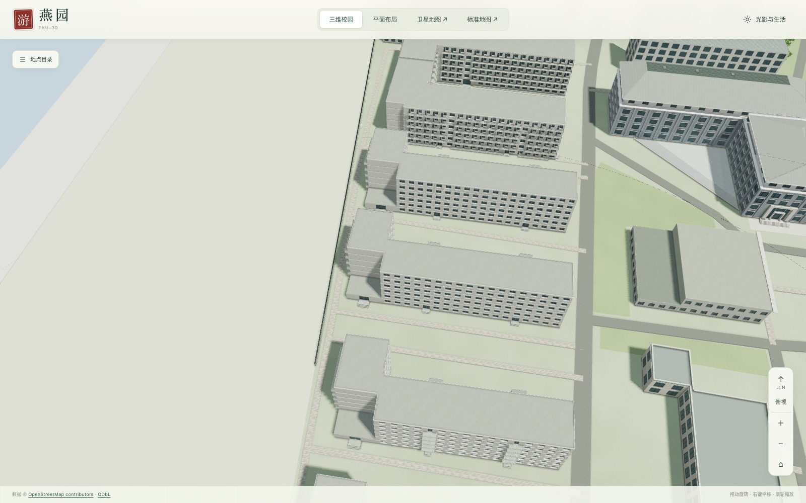
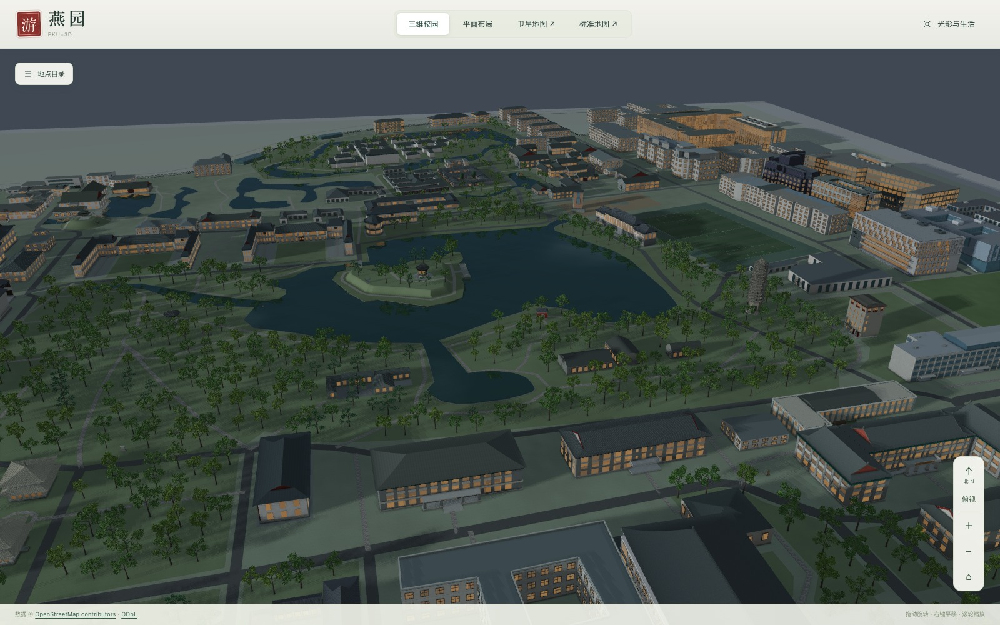

<div align="center">

# PKU-3D

**Peking University in 3D**

Built with **GPT-6 Astra**. All source data and modeling references are publicly available.

**[Demo](https://sldyns.github.io/PKU-3D/)** · [中文](README.zh-CN.md) · [Releases](https://github.com/sldyns/PKU-3D/releases) · [Contributing](CONTRIBUTING.md)

[](https://github.com/sldyns/PKU-3D/releases/tag/v1.2.0)
[](https://sldyns.github.io/PKU-3D/)

</div>

An unofficial campus visualization.

https://github.com/user-attachments/assets/67393710-bc94-461c-9472-c6d6b0e4581e

[](https://sldyns.github.io/PKU-3D/)

PKU-3D is an interactive model of Peking University's Yanyuan campus, with individual buildings, courtyards, roads and lakes. It runs in the browser and includes building search, map overlays, changing light and weather, and pedestrians following campus paths.

<table>
<tr>
<td width="50%"><br><b>West Gate</b></td>
<td width="50%"><br><b>Courtyards</b></td>
</tr>
<tr>
<td colspan="2"><br><b>Weiming Lake at dusk</b></td>
</tr>
</table>

## Features

- Building search and selection, with front, side and roof views.
- 3D and plan views in the same coordinate system, with links to satellite and standard maps.
- Time of day, seasons and weather, with vegetation, water reflections and walking pedestrians.
- Route planning along the campus road network.

## Controls

| Input | Action |
| --- | --- |
| Left-button drag | Orbit in 3D; pan in plan view |
| Right-button drag, or `Shift` + left-button drag | Pan |
| Mouse wheel | Scroll up to zoom in, down to zoom out |
| Left click on a building or place label | Show building details |
| Arrow keys | Pan |
| `+` / `−` | Zoom in / out |
| `/` | Open building search |
| `Esc` | Close a dialog or building details |

On touchscreens, drag with one finger and pinch with two fingers to zoom. Use the **⌂** button to return to the campus overview. The **操作说明** button at the bottom right opens the controls guide.

A desktop browser with WebGL 2 support is recommended. The interface currently uses Chinese.

## Data

**All source data and modeling references come from public sources:** OpenStreetMap, Esri World Imagery, and publicly accessible university, department and architectural materials. Source attribution is documented in [Data sources](docs/SOURCES.md).

The model is being refined; some dimensions and architectural details are approximate.

## Development

```sh
git clone https://github.com/sldyns/PKU-3D.git
cd PKU-3D
npm install
npm run setup
npm run build
npm run dev
```

See [Development](docs/DEVELOPMENT.md) for requirements, scene builds and the repository layout.

## Contributing

Building corrections, modeling improvements and interface fixes are welcome. For a spatial correction, include the building name, a marked scene screenshot and a public source link when available. See [Contributing](CONTRIBUTING.md) for details.

## License

[MIT](LICENSE) for software and original documentation; [ODbL 1.0](DATA_LICENSE.md) for the OSM-derived geographic database. Third-party rights remain with their holders. See [Licensing notes](docs/LICENSING.md).
